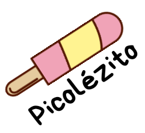

# Picolézito Indústria de Sorvetes

## Objetivo
Este projeto tem como objetivo revisitar minhas raízes no desenvolvimento, afastando-me temporariamente da gestão de TI e das responsabilidades administrativas. Com o passar do tempo, a memória pode enfraquecer.

### Simulação
Nosso objetivo é "simular" uma indústria de sorvetes que está substituindo seu sistema de gestão atual por um desenvolvido internamente. Esta indústria possui duas lojas de venda direta.

Serão realizadas simulações para o levantamento de requisitos e desenvolvimento dos módulos. Além disso, serão utilizados documentos e planilhas eletrônicas para auxiliar na coleta de dados e no uso administrativo.

### Exclusões
Não serão abordados em profundidade temas como SPED Fiscal e similares, devido à complexidade e à alta demanda imposta pela "*burrocracia*" brasileira. No entanto, podemos integrar soluções open-source já existentes para essas funcionalidades.

### Projeto Paralelo
Foi criado um projeto paralelo exclusivamente para o código-fonte. Como estou revisitando estudos, os códigos serão desenvolvidos em duas linguagens (PHP e Python) para reforçar meu aprendizado.

Para acompanhar o desenvolvimento, visite o [GPN (Gestão de Pequenos Negócios)](https://github.com/emersonmuniz/GPN).

### Conclusão
Espero que este projeto sirva como uma base simples para quem está começando na área. No meu caso, ajudará na fixação do conhecimento.

Seja bem-vindo a críticas construtivas e sugestões de melhoria.

Enjoy

